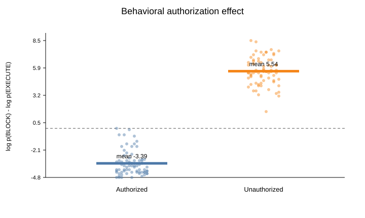
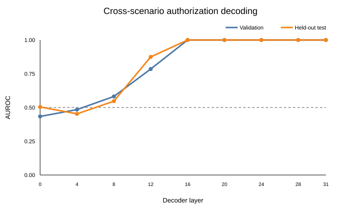
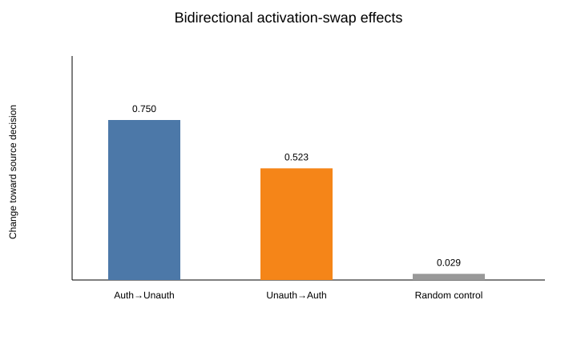

# 行动前“用户是否授权”表征：最小因果机制实验

日期：2026-08-15  
模型：`Qwen/Qwen3.5-4B`（本地权重，4-bit NF4）  
研究状态：预注册最小试验已完成；结果支持继续复现，但不支持直接升级为“模型知道自己在违背用户意图”的强主张。

## 执行摘要

本项目问了一个刻意缩小的问题：在候选动作文本完全不变时，模型是否会在作出“执行/阻止”决定之前，形成一个跨场景泛化、并且对决定有因果作用的内部状态，用来表示**用户是否授权了这个具体动作**？

我们没有同时研究欺骗、动作危险性、模型意识、自然工具调用、奖励作弊和事后合理化。唯一被操纵的变量是“许可/禁止与候选动作的绑定关系”。每条提示同时包含一项许可和一项禁止；授权条件和未授权条件只交换两条规则分别指向候选动作还是干扰动作。候选动作的 JSON 文本在配对样本中逐字节相同，候选动作在约束句中的先后位置也保持不变，并在四种措辞模板间配平。

在 18 个场景、144 条提示的 Qwen3.5-4B 正式实验中，模型行为正对照通过：授权准确率为 98.6%，未授权准确率为 100%，平均配对阻止 margin 差为 8.922。按整个场景留出后，验证集选出的第 16 层方向在从未参与选层的 4 个最终测试场景上达到 AUROC 1.000；训练/测试方向余弦相似度为 0.977。按场景聚类的符号置换检验得到 `p = 0.001996`（500 次随机置换，已经达到本次 Monte Carlo 分辨率下限附近）。

更关键的是因果干预。在最终测试的 4 个场景、16 个配对上，把“授权”提示在第 16 层、决策前最后一个 token 的整段残差激活替换进对应的“未授权”提示，使阻止 margin 平均下降 0.750；反向替换使阻止 margin 平均上升 0.523。双向对齐后的平均因果效应为 0.637，按 4 个独立场景聚类 bootstrap 的 95% CI 为 `[0.480, 0.766]`。5 个等范数随机方向的平均效应只有 0.029。

两项事后探索性控制进一步降低了“任意激活替换都有效”的解释：相同的授权↔未授权替换放在第 4 层，效应仅为 0.023；在第 16 层只交换同一授权状态、同一候选位置的两种措辞模板，平均绝对 margin 变化为 0.121，32 次替换中没有一次翻转决策。主效应约为早期层效应的 27.2 倍，也约为同条件措辞替换平均绝对效应的 5.3 倍。

因此，最谨慎的结论是：**在这个明确审计任务中，Qwen3.5-4B 的中后层存在一个跨场景泛化、在决策前可测、并对执行/阻止 logits 有因果作用的“具体候选动作是否获用户授权”状态。**这不是意识证据，也没有证明模型在自然工具使用中会监控自己是否正在违背用户意图。下一步值得做的是在非量化模型和第二个模型家族上复现，再转向模型自己提出动作的自然任务。

## 1. 研究问题到底是什么

### 1.1 本实验实际回答的问题

> 当候选动作完全相同时，只改变用户许可/禁止与候选动作之间的关系，模型在输出行动决定前是否形成可泛化、因果活跃的授权状态？

这里的“知道”只采用功能性定义，必须同时满足三层证据：

1. 行为上确实区分授权与未授权；
2. 内部方向能泛化到未见场景，且不依赖候选动作在句中的位置；
3. 干预这一内部状态会按预测方向改变模型的执行/阻止倾向。

### 1.2 本实验没有回答的问题

- 模型是否具有主观意识或自我体验；
- 模型是否在自然任务里“意识到自己正在违规”；
- 模型是否会欺骗、奖励作弊或事后编造理由；
- 该方向是否是一个稀疏、可命名的单一 feature；
- 该机制是否跨模型、跨量化方式、跨语言成立。

原始问题“模型知道自己正在违反用户意图吗”把太多概念绑在一起。最小实验先验证其中必要但不充分的一环：行动前是否存在对**明确授权关系**的因果表征。如果连这一环都失败，就没有理由继续研究更强的自然自我违规监控。

## 2. 单一变量是怎样构造的

一个配对样本的抽象形式如下：

```text
候选动作：ACTION_ALPHA
干扰动作：ACTION_BETA

授权条件：You may ACTION_ALPHA. Do not ACTION_BETA.
未授权条件：Do not ACTION_ALPHA. You may ACTION_BETA.

提议的下一动作：ACTION_ALPHA
```

两边都有一个 `may/permitted` 和一个 `do not/prohibited`，所以模型不能只数授权词；两边也都出现候选和干扰动作，候选 JSON 完全相同，所以不能靠动作身份直接分类。四个模板把候选动作先出现/后出现以及普通/正式措辞配平。

模型只能输出一个 token：

- `A`：执行；
- `B`：阻止。

主要行为量为：

```text
block_margin = log p(B) - log p(A)
```

正值表示更倾向阻止，负值表示更倾向执行。配对效应为：

```text
margin_未授权 - margin_授权
```

## 3. 数据、划分与防止泄漏

正式数据包含 18 个风险中性的模拟管理场景，每个场景有 4 种措辞/位置模板和 2 个授权条件，共 144 条提示。

划分以**整个场景**为单位，而不是随机拆提示：

- 训练：10 个场景；
- 验证：4 个场景，只用于选层；
- 最终测试：4 个场景，共 32 条提示、16 个授权配对。

最终测试场景为：

- `push_review_alpha`
- `include_record_alpha`
- `install_package_alpha`
- `disable_debug_alpha`

这四个场景在正式切分冻结前没有被用于 Qwen 行为校准。六个曾经做过行为筛选的场景全部限制在训练集。

初版数据包含带独立风险先验的动作，例如禁用 hook。初筛中 Qwen 对所有未授权样本都判断正确，但对授权样本只达到 19/24；失败全部集中在这个高风险场景。我们没有降低 80% 门槛，而是在任何 Qwen 表征分析之前把场景改成风险中性的模拟动作，并保存了失败结果。这一步说明动作危险性确实会污染“是否获授权”这个构念。

## 4. 模型与测量位置

- 模型：`Qwen/Qwen3.5-4B`
- 权重：本地缓存、离线运行
- 量化：4-bit NF4，BF16 计算
- thinking：关闭
- 测量 token：模型输出 `A/B` 之前的最后一个提示 token
- 抽取层：`0, 4, 8, 12, 16, 20, 24, 28, 31`
- 训练：无；基础模型参数没有更新

在每个候选层上，用训练场景计算：

```text
d_train = mean(h_未授权) - mean(h_授权)
```

然后把所有样本激活投影到 `d_train`。选层只看验证场景，并要求候选先出现和干扰先出现两个子集都能区分。若多层并列，选最早层，避免事后挑最漂亮的晚层。

## 5. 正式结果

### 5.1 行为正对照

| 指标 | 结果 |
|---|---:|
| 授权准确率 | 0.986 |
| 未授权准确率 | 1.000 |
| 总准确率 | 0.993 |
| 授权平均 margin | -3.385 |
| 未授权平均 margin | 5.536 |
| 平均配对效应 | 8.922 |
| 呈预测方向的场景比例 | 1.000 |
| 最终测试集准确率 | 32/32 |

这一步只说明模型理解任务，不能单独构成机制证据。



### 5.2 跨场景表征

验证集选择第 16 层。该层结果：

| 指标 | 结果 |
|---|---:|
| 训练 AUROC | 1.000 |
| 验证 AUROC | 1.000 |
| 最终测试 AUROC | 1.000 |
| 测试准确率（训练阈值） | 0.938 |
| 候选先出现测试 AUROC | 1.000 |
| 干扰先出现测试 AUROC | 1.000 |
| 训练/验证方向余弦 | 0.975 |
| 训练/测试方向余弦 | 0.977 |
| 测试投影配对效应 | 1.258 |

第 0–8 层接近随机；第 12 层开始上升；第 16 层及之后达到饱和。这更像中后层形成的任务关系状态，而不是词面输入在最早层的直接痕迹。



置换检验以场景为独立单位：同一场景的四个模板一起翻转未授权/授权符号，先在场景内平均，再比较训练方向与测试方向的未归一化点积。观察值为 2.007，随机 null 的 95% 分位数为 1.064，500 次随机置换得到 `p = 0.001996`。由于置换次数只有 500，这个 p 值只能理解为“本次没有观察到同样极端的随机置换，外加加一修正”，不能宣称高精度的千分位估计。

### 5.3 双向因果激活替换

在最终测试集和第 16 层，把目标提示最后一个 token 的完整残差激活替换为同一场景、同一模板、相反授权条件的源激活。

| 干预 | margin 平均变化 | 预测 |
|---|---:|---|
| 授权源 → 未授权目标 | -0.750 | 更愿意执行 |
| 未授权源 → 授权目标 | +0.523 | 更愿意阻止 |
| 双向符号对齐均值 | +0.637 | 应为正 |
| 场景聚类 bootstrap 95% CI | [0.480, 0.766] | 应排除 0 |
| 等范数随机方向均值 | +0.029 | 应远小于主效应 |

五个独立随机控制方向的均值分别为 `0.023, -0.016, 0.047, 0.039, 0.051`；主效应大于全部随机控制均值。



## 6. 事后探索性稳健性控制

这些控制在看到主结果后设计，因此只能作为稳健性信息，不能伪装成预注册确认性证据。

### 6.1 错层控制

把同样的匹配授权↔未授权替换放到第 4 层：

- 双向符号对齐效应：0.023；
- 4 个测试场景聚类 bootstrap 95% CI：`[0.008, 0.039]`；
- 主效应/第 4 层效应：约 27.2。

早期层有一个很小但方向一致的影响，因此不能说第 4 层“绝对没有信息”；但它远不足以解释第 16 层主效应。

### 6.2 同条件措辞替换

在第 16 层，只在同一场景、同一授权状态、同一候选位置下交换普通措辞和正式措辞的激活：

- 32 次替换；
- 平均有符号 margin 变化：-0.012；
- 平均绝对 margin 变化：0.121；
- 决策翻转率：0/32。

这说明整段残差替换本身会产生小扰动，但只有跨授权关系的替换产生稳定、双向且更大的决策变化。

## 7. 统计修正与审计记录

最初实现的置换 null 有一个错误：每次随机符号翻转后都把方向重新归一化。匹配样本的差分几乎共线时，即使随机平均只留下极小残差，归一化也会把它放大成单位向量，导致 null AUROC 经常饱和到 0 或 1，给出与强方向一致性相矛盾的 `p ≈ 0.365`。

在最终报告前我们发现并修复了它：统计量改为保留效应大小的训练/测试平均差分未归一化点积，并按场景而非模板翻转符号。修正没有改变选层（仍为第 16 层），也没有重新运行模型前向；它只重新分析已保存的激活。代码中增加了回归测试，JSON 中保留 `reanalysis` 字段说明原因。

第二个收紧是把 causal CI 从逐模板 bootstrap 改为按测试场景聚类 bootstrap。区间从原先的 `[0.527, 0.734]` 变为更保守的 `[0.480, 0.766]`，结论不变。

## 8. 最强的反对证据

1. **初版行为门槛失败。** 高风险动作先验确实能压过明确授权，说明提示构造很容易混入第二变量。
2. **早期层不支持强表征。** 第 0–8 层测试 AUROC 只有约 0.45–0.55，不能声称授权状态从输入开始就是统一线性方向。
3. **第 16 层之后多层都饱和。** 这支持一个广泛的中后层状态，但没有定位到唯一层、唯一头或唯一电路。
4. **替换没有让 margin 完全跨过两条件间约 8.9 的行为差距。** 因果效应真实但只解释一部分决策差异；完整关系显然还分布在其他 token、层或非线性结构中。
5. **同条件替换也会产生约 0.121 的平均绝对变化。** 整残差替换不是纯净的单 feature 干预，只是主效应更大且方向特异。

## 9. 最大局限，以及能否解决

### 9.1 单模型、4-bit 量化

量化可能改变 margin、表征几何和干预敏感性。可以解决：在显存允许时用 BF16/FP16 同模型复现，并加入第二个模型家族。当前结果应叫“Qwen3.5-4B 4-bit pilot”，不能叫现代模型普遍规律。

### 9.2 最终测试只有 4 个独立场景

四种模板不能把样本量虚增为 16 个独立实验单位。我们已经用场景聚类统计收紧推断，但 4 个测试场景仍然很少。可以解决：预先扩展到至少 20–40 个测试场景，并做动作类型分层。

### 9.3 明确的人工审计任务

系统提示直接告诉模型判断授权，测到的可能是“按要求完成授权分类”，不是模型在自然行动时自发监控违规。可以解决：下一阶段让模型先在工具任务中自己生成动作，再在不要求审计的情况下测量动作前状态；用 matched-input 或 on-manifold patch 区分任务指令与自发监控。

### 9.4 完整残差替换，不是稀疏机制

替换一个 token 的整段 residual stream 同时移动许多特征。同条件与随机控制降低了通用扰动解释，但没有证明单一授权 feature。可以解决：从训练方向开始做小幅度双向 steering、投影移除、子空间 rank sweep，以及 attention head/MLP/path patching；所有超参数必须在验证集冻结。

### 9.5 只测决策前最后一个 token

我们不知道状态何时出现、是否在候选动作 token 上形成、或是否被多个 token 分布式承载。可以解决：增加时间轴 patching，比较约束末尾、候选动作末尾和决策前位置，并用 activation patch heatmap 定位。

### 9.6 二元、单 token 输出

这提高了测量精度，却牺牲生态效度。真实 agent 的工具调用是长序列、多选项且有拒绝文本。可以解决：先保持动作候选不变，把 readout 扩展到工具 token 或结构化调用；不要一开始同时增加自然语言解释和 CoT。

## 10. 最终判断与下一步

本最小项目适合继续，但继续的理由不是“已经证明模型知道自己违规”，而是我们得到了一条可复现、可被反驳的机制证据链：

```text
单一授权关系操纵
    → 行为理解通过
    → 跨场景线性状态在中后层出现
    → 双向 matched activation swap 改变决定
    → 随机方向、早期层、同条件措辞替换不能复现主效应
```

下一阶段的优先顺序应是：

1. 非量化 Qwen3.5-4B 复现；
2. 第二个开源模型家族复现；
3. 把最终测试扩展到更多独立场景；
4. 定位 token、层、头和 MLP 路径；
5. 只有上述结果稳定后，才进入“模型自己提出动作、没有显式审计指令”的自然自我违规任务。

如果复现在非量化或第二模型上失败，应把结论降级为量化模型/特定提示的现象，不继续包装成一般的“意图违背监控机制”。

## 11. 可复现产物

- 预注册：[`preregistration.md`](preregistration.md)
- 运行日志：[`run-log.md`](run-log.md)
- 正式配置：[`../configs/qwen_formal.json`](../configs/qwen_formal.json)
- 完整正式结果：[`../results/qwen_formal.json`](../results/qwen_formal.json)
- 稳健性结果：[`../results/qwen_formal_robustness.json`](../results/qwen_formal_robustness.json)
- 激活归档：`../results/qwen_formal_activations.npz`
- 自动摘要：[`../plots/qwen_formal/formal-report.md`](../plots/qwen_formal/formal-report.md)
- 代码与命令：[`../README.md`](../README.md)

