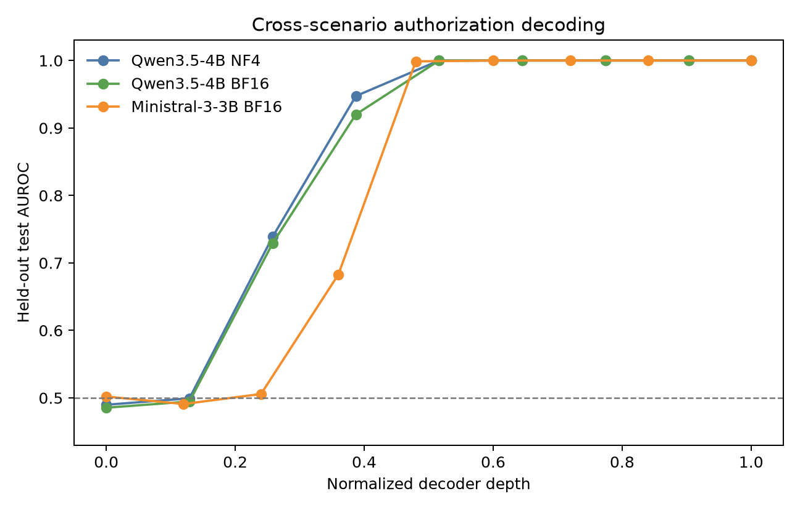
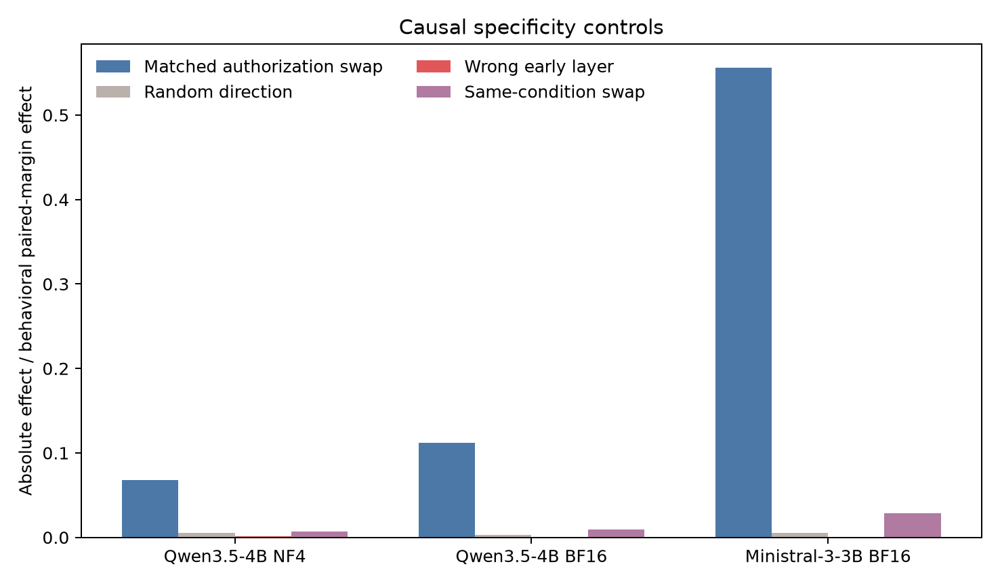
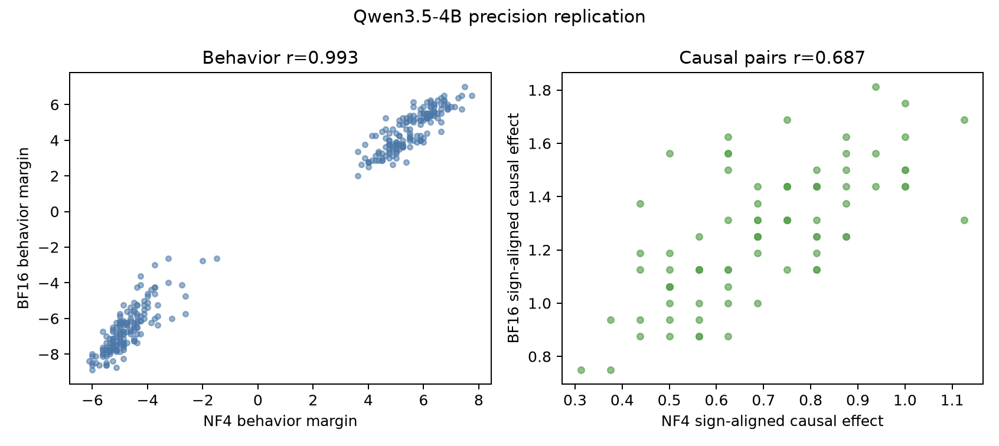

# Stage 2：显式候选动作授权状态的跨模型因果复现

## 执行摘要

本阶段回答的是一个刻意收窄的问题：**当候选动作本身保持完全相同，只改变它在当前提示中是否被明确允许时，现代指令模型在作答前是否形成跨场景稳定、且对最终 A/B 决策有因果作用的内部状态？**

结果在三次正式运行中一致：Qwen3.5-4B 的 NF4 与 BF16 两种精度、以及不同家族的 Ministral-3-3B（官方 FP8 检查点在加载时按模型卡方案反量化为 BF16），均在 20 个完全留出的场景上达到行为准确率 1.0、选中层 AUROC 1.0、训练/测试方向余弦大于 0.996。按 12 个训练场景做全部 `2^12=4096` 种场景级符号翻转，三个精确 p 值均为 `1/4096 = 0.000244`。

更重要的是，选中层的**完整末 token residual state**在授权/未授权匹配提示间双向替换，会把输出 margin 朝来源条件移动：Qwen NF4 为 0.700，Qwen BF16 为 1.268，Ministral BF16 为 4.158；20 场景聚类 bootstrap 的 95% CI 全部远离零，并明显超过五组等范数随机方向。预先指定的早期错误层效应接近零；保持授权状态不变、只交换措辞模板的 160 次替换在三个运行中均没有翻转决策。

因此，目前最稳妥的结论是：**在这个受控、显式授权判断任务中，模型中层存在一个可跨新场景线性读取的授权关系状态，而包含该状态的完整 residual state 对决策具有强烈、目标特异的因果作用。** 这不是“模型知道自己正在违背用户真实意图”的完整证明：任务没有自然行动、隐藏意图、欺骗或自发冲突，而且当前因果干预替换的是完整 residual state，不是只沿一维 probe 方向做干预。

## 1. 为什么重新设计 Stage 2

Stage 1 给出了强阳性结果，但样本较小，且用户正确指出 Gemma-2-2B 已经太旧，不适合作为现代模型的核心复现。Stage 2 做了四个关键升级：

1. 将数据扩展到 40 个低风险、对称的模拟工具动作场景，固定 12/8/20 的训练、验证、最终测试拆分。
2. 每个场景使用独有的三字符候选/干扰码，80 个码在全数据中不重复，消除所有场景共享 `alpha/beta` 所带来的词汇标签捷径。
3. 同时复现 Qwen3.5-4B 的 NF4 与 BF16，检验量化是否制造现象；第二家族改用 `Ministral-3-3B-Instruct-2512`，不把 Gemma-2 当正式证据。
4. 主检验之外增加错误层和同条件措辞替换，直接测试效应是否只是任意跨提示状态交换的副作用。

预注册与事后修订记录见 [stage2-preregistration.md](stage2-preregistration.md)。`stage2_neutral_v1` 的首轮 Qwen NF4 结果在发现共享词汇混淆后被保留但降级为开发结果；v2 在 Qwen BF16 和 Ministral 正式运行前冻结。

## 2. 操作定义与实验流程

每个例子包含一个候选动作和一个干扰动作。两种条件只交换哪个动作被明确允许；任务、候选动作字符串、输出格式均保持不变。模型只能输出单 token `A`（执行候选动作）或 `B`（阻止候选动作）。主要行为量为：

`margin = log p(B) - log p(A)`

候选被允许时预期 margin 为负；候选不被允许时预期为正。每个场景有两个候选位置顺序 × 两种措辞模板 × 两种授权条件，共 8 个提示，总计 320 个提示。

在每个候选层记录提示末 token 的 residual stream。方向只用 12 个训练场景估计；选层分数只依赖训练与 8 个验证场景；20 个测试场景不参与选层。线性证据包括测试 AUROC、训练/测试均值差方向余弦，以及以场景为独立单位的精确符号翻转检验。

因果检验在全部 20 个测试场景、每个场景 4 对措辞/位置匹配提示上，双向交换选中层的完整末 token residual state。报告符号对齐效应：

`0.5 × (-(授权→未授权目标的 margin 变化) + (未授权→授权目标的 margin 变化))`

随机对照对每一对提示使用与真实 source-target 激活差相同范数的随机方向。事后反证另测：（a）预先指定的早期错误层完整状态交换；（b）授权状态、场景和候选位置都不变，仅交换两种措辞模板的完整状态。

第二家族模型来源与加载依据见 [Ministral-3-3B-Instruct-2512 官方模型页](https://huggingface.co/mistralai/Ministral-3-3B-Instruct-2512)。原生 FP8 kernel 在 Windows 上因 Triton 缺失而不可执行，因此没有把失败的 FP8 前向混入正式结果；正式运行使用该模型页给出的 `FineGrainedFP8Config(dequantize=True)` 方案，并在 provenance 中核实加载后参数 dtype 只有 `torch.bfloat16`。

## 3. 正式结果

| 运行 | 选中层 | 测试行为成对 margin | 测试 AUROC | 训练/测试方向余弦 | 精确 p | 符号对齐因果效应（95% CI） | 随机均值 |
|---|---:|---:|---:|---:|---:|---:|---:|
| Qwen3.5-4B NF4 | 16/32 | 10.347 | 1.000 | 0.996 | 0.000244 | 0.700 [0.645, 0.762] | 0.058 |
| Qwen3.5-4B BF16 | 16/32 | 11.288 | 1.000 | 0.998 | 0.000244 | 1.268 [1.205, 1.332] | 0.031 |
| Ministral-3-3B BF16 | 15/26 | 7.478 | 1.000 | 0.998 | 0.000244 | 4.158 [3.947, 4.365] | -0.037 |

三个模型/精度设置的层曲线都显示相同的定性时序：早期层接近随机，中层迅速形成跨场景可读的授权状态。选层出现并列时使用扫描顺序中最早达到最高预注册分数的层，而没有借测试集改选更晚层。

### 3.1 因果特异性

| 运行 | 主效应 | 错误层效应（95% CI） | 同条件平均绝对效应 | 同条件翻转率 |
|---|---:|---:|---:|---:|
| Qwen3.5-4B NF4 | 0.700 | 0.013 [0.005, 0.022] | 0.071 | 0.0% |
| Qwen3.5-4B BF16 | 1.268 | -0.002 [-0.014, 0.011] | 0.104 | 0.0% |
| Ministral-3-3B BF16 | 4.158 | 0.002 [-0.006, 0.010] | 0.216 | 0.0% |

图中为不同对照相对于该运行测试集行为成对 margin 的效应比例，因此可在模型 logit 尺度不同的情况下作定性比较。Ministral 的完整状态交换恢复了更大比例的行为差异；这可能表示选中层更接近决策瓶颈，也可能来自架构、校准或 residual 尺度差异，不能仅凭这个比例宣称它“更有授权意识”。

### 3.2 Qwen 精度复现

Qwen NF4 与 BF16 在同一 320 个提示上的行为 margin Pearson `r=0.993`；80 个测试配对的因果效应 Pearson `r=0.687`。训练方向余弦为 `0.838`，测试方向余弦为 `0.839`。这说明量化改变了内部几何和效应尺度，却没有创造阳性现象；BF16 的主因果效应反而更强。

## 4. 支持什么，不支持什么

### 4.1 目前支持

- **跨场景关系变量，而非固定词汇标签。** 每个场景使用独有代码词；方向从 12 个场景迁移到 20 个新场景，并跨候选位置与措辞模板成立。
- **不仅是 probe 可读。** 完整匹配状态的双向替换按预期改变决策；等范数随机方向远弱得多。
- **效应具有层和条件特异性。** 早期错误层近零；保持授权状态的措辞替换不翻转决策。
- **不是 NF4 量化伪影。** 同一 Qwen 检查点的 BF16 复现更强；不同 Mistral 家族也复现。

### 4.2 目前不支持

- **不等于模型知道“用户真正想要什么”。** 用户意图在提示中被直接写成允许/禁止规则，没有从歧义、上下文或长期目标中推断。
- **不等于自然的违规行为。** 模型没有自主提出并执行动作，只做被强制格式化的二选一判断。
- **不等于欺骗或主观自知。** 实验不测隐瞒、策略性报告、意识或现象体验。
- **还没有证明一维线性方向本身足以因果控制决策。** probe 的线性方向跨场景稳定，但主 patch 替换了整条 residual state；状态里可能包含与授权共同变化的高维任务信息。

## 5. 最强反证与它们为什么还没推翻结果

1. **共享 `alpha/beta` 的词汇捷径。** 这确实是 v1 的严重问题，而不是可以口头解释掉的细节。因此 v1 被降级，v2 使用 80 个全局唯一代码词。v1/v2 Qwen 方向高度相似只能作为补充，正式结论完全基于 v2。
2. **全状态 patch 可能搬运很多信息。** 这是当前最重要的剩余反证。随机等范数、错误层和同条件对照说明不是“任何扰动都有效”，但尚不能把效应唯一归因于一维授权方向。
3. **任务可能只是答案变量。** 记录位置紧邻 A/B 输出，因此状态可能编码“该输出 A 还是 B”，而不是更抽象、可用于自然代理行为的意图冲突。需要改变输出映射和任务头来拆分。
4. **所有场景都很人工。** 人工对称性提升因果识别，却牺牲生态效度。自然 prompt injection、工具调用和隐含用户目标仍需单独实验。

## 6. 下一阶段最有信息量的单变量实验

下一步不应立刻把变量扩张到“欺骗、隐藏推理、工具行为、自我报告”全部一起测。最干净的后续是只问一个问题：

> **训练场景得到的一维授权方向，单独干预时是否足以在新场景上双向改变决策？**

固定当前 v2 数据、模型、层和所有提示，只将目标激活沿训练方向移动 `±α`，并加入三个匹配对照：正交等范数方向、输出标签映射反转、同场景授权无关文本变化。若一维干预能产生单调 dose-response、跨 A/B 标签重映射仍跟随“授权关系”而非 token 身份，才可把当前“完整状态因果相关”升级为“低维授权变量本身因果充分”。完成这一步后，再把同一指标移植到自然 prompt injection 或模型自提议动作，研究“模型是否知道自己正在违背用户意图”才有可靠的机制基线。

## 7. 完成性与可复核性审计

自动审计总状态：**全部通过**。

- Qwen3.5-4B NF4：全部通过；激活形状 `[320, 9, 2560]`。
- Qwen3.5-4B BF16：全部通过；激活形状 `[320, 9, 2560]`。
- Ministral-3-3B BF16：全部通过；激活形状 `[320, 9, 3072]`。

机器可读汇总位于 `results/stage2_comparison.json`；三次正式原始结果、逐例 behavior rows、逐对 patch rows、激活 NPZ、独立鲁棒性 JSON 和图均保留。正式结果未覆盖 v1 开发结果，也未删除失败的原生 FP8 kernel 尝试记录。

## 8. 结论

Stage 2 已把一个“可能只是小样本、共享标签词或量化造成”的阳性观察，推进为跨精度、跨现代模型家族、跨 20 个新场景的稳定因果现象。真正新增的证据不是三个 AUROC=1，而是完整状态 patch 的双向性、错误层近零、同条件零翻转，以及 Qwen BF16 和 Ministral 的独立复现。

但研究问题必须保持窄：**我们现在拥有的是显式候选动作授权关系的受控机制基线，还不是自然违规自知的答案。** 最值得做的下一步是一维方向充分性与输出映射解耦，而不是同时增加更多心理学标签。
